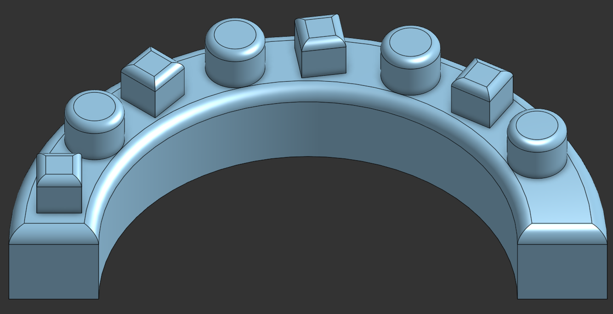
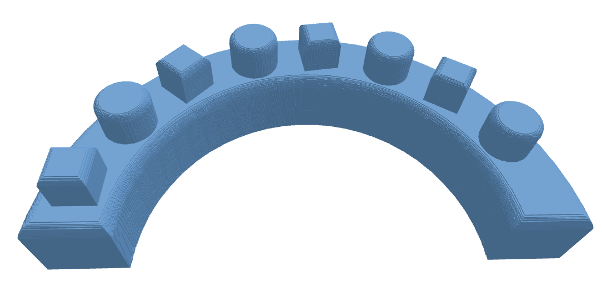

# slice_to_3d

A proof-of-concept that reverses the 3D-print slicing process: given a stack of PNG layer images (like a slicer's per-layer preview), reconstruct an approximate 3D mesh of the original object.

The reconstruction is voxel-based, so it naturally preserves the "stepped" look of a real print rather than producing a perfectly smooth surface.

## Motivation

When I was working with 3D printers, customers would sometimes send over a print file for troubleshooting, but the original 3D object file wasn't always available. Without it, it's hard to get a clear picture of the actual geometry you're debugging. This tool reconstructs an approximation of that geometry directly from the slices, so you have something concrete to look at even when the source model is gone.

## How it works

Two scripts:

- **`generate_slices.py`** — produces a stack of PNG layer masks, either from a parametric shape (sphere/cube/cone) or by slicing an existing CAD mesh (e.g. an STL exported from OnShape). Writes the PNGs plus a `meta.json` sidecar (pixel size, layer height, image dimensions) into an output folder.
- **`reconstruct.py`** — loads a PNG stack + `meta.json`, stacks it into a 3D voxel volume, extracts a surface mesh with marching cubes, and exports an STL.

Because both scripts agree on a common intermediate format (PNG stack + `meta.json`), the slice source (parametric shape vs. real CAD mesh) is decoupled from the reconstruction step.

## Setup

```
conda create -n slice_to_3d python=3.12
conda activate slice_to_3d
pip install -r requirements.txt
```

## Usage

### Slicing a parametric shape

```
python generate_slices.py --pixel-size 0.2 --layer-height 0.2 --out-folder slices sphere --radius 10
python generate_slices.py --pixel-size 0.2 --layer-height 0.2 --out-folder slices cube --side 20
python generate_slices.py --pixel-size 0.2 --layer-height 0.2 --out-folder slices cone --radius 10 --height 20
```

Each run writes into `<out-folder>/<shape>/`.

### Slicing a CAD mesh

```
python generate_slices.py --pixel-size 1.0 --layer-height 2.0 --out-folder slices from-mesh --input examples/onshape_part.stl
```

Writes into `<out-folder>/from-mesh/`. The mesh's own bounding box determines the canvas size and layer count — no shape parameters needed.

### Reconstructing

```
python reconstruct.py slices/from-mesh -o reconstructed/reconstructed.stl
```

Options:

- `--view` — open an interactive viewer (`` ` `` for help, `a` toggles axes, `g` toggles grid)
- `--color R G B` — set the viewer's mesh color (viewer only, not saved in the STL)
- `--compare-to <original.stl>` — print both meshes' bounding-box extents side by side, to empirically check the reconstruction's dimensions against the original (useful since a visual check alone won't catch a scale mismatch)

Example combining everything:

```
python reconstruct.py slices/from-mesh -o reconstructed/reconstructed.stl --view --color 100 150 200 --compare-to examples/onshape_part.stl
```

## Example

`examples/onshape_part.stl` and `slices/from-mesh/` in this repo are a worked example: a bracket part exported from OnShape, sliced at `--pixel-size 1.0 --layer-height 2.0`.

| Original (OnShape) | Reconstructed |
|---|---|
|  |  |

Reconstructing it and comparing extents:

```
original extents (mm):      [ 22.5        100.          49.94200134]
reconstructed extents (mm): [ 22.60000229 100.00000305  49.90000076]
```

## Notes

- STL files don't carry a unit — this pipeline assumes millimeters throughout (`--pixel-size`/`--layer-height` in mm), so export CAD meshes in mm.
- Finer `--pixel-size`/`--layer-height` gives a more accurate reconstruction at the cost of more layers and a much larger output mesh.
- Layer PNGs are purely binary (pixels are either fully white or fully black) — grayscale/anti-aliasing is intentionally omitted to keep the rasterization and reconstruction code simple, since this is a proof of concept.
